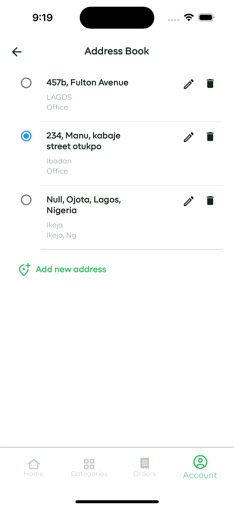

<div align="center">
   

## TAGO

<strong> Introducing "Tago", an app that brings convenience and ease to your shopping experience, you can browse and purchase a wide variety of products from the comfort of your home, and have them delivered straight to your doorstep.

Whether you're craving delicious foodstuffs, in need of essential cosmetics, or looking for other everyday items, "Tago App" has got you covered. Our extensive catalogue features a diverse range of products, ensuring that you'll find everything you need in one convenient location.</strong>

<br/>
<!-- <a href='https://apps.apple.com/ng/app/connect-me-digital-identity/id6478838388'></a>
<a href='https://play.google.com/store/apps/details?id=com.capturedHeart.connectMe'></a> -->

<sub>Built by <a href="https://twitter.com/_Captured_Heart">Nkpozi Marcel Kelechi</a></sub>
<br />

<!-- ## AN INTRO VIDEO OF THE APP -->

<!-- https://github.com/Captured-Heart/connect_me/assets/69226443/63c2abe0-4c5f-4151-9f9a-77beb289a4b7 -->

<!-- <i><h3 style="color: green">You can download the apk directly from my firebase distribution console <a href="https://appdistribution.firebase.dev/i/e5a7b73fefe2dd61">LearnGual Assessment</a></h3></i> -->

</div>

---

## Getting Started

After cloning,

### FVM setup

it runs on flutter version: flutter: ">=3.10.0", dart: ">=3.0.0 <4.0.0".

Install `fvm` if not already installed.

```bash
dart pub global activate fvm
```

Install local `flutter` version.

```bash
fvm install
```

---

# Key Features

1. Seamless Shopping Experience:

   - Our user-friendly interface makes browsing and purchasing products a breeze. With just a few taps, you can explore our extensive selection and add items to your cart with ease.

2. Convenient Delivery Options:

   - Say goodbye to long queues and tedious shopping trips. With our delivery service, your orders will be delivered directly to your doorstep at a time that's convenient for you. No more hassle, no more stress - just convenience at your fingertips.

3. Real-Time Order Tracking:

   - Track the status of your orders in real-time with our built-in GPS tracking feature. Know exactly when your order will arrive and stay informed every step of the way.

4. Secure Payment Options:

   - Shop with confidence knowing that your transactions are safe and secure. We offer a variety of payment options to suit your preferences, so you can shop with peace of mind.

5. Personalized Recommendations:

- Discover new products and find items tailored to your preferences with our personalized recommendation feature. We'll suggest products based on your shopping history, making it easier than ever to find exactly what you're looking for.

## UI Shots

<div style="text-align: center">
  <table>
    <tr>
      <td style="text-align: center">
        
      </td>
      <td style="text-align: center">
        
      </td>
      <td style="text-align: center">
        
      </td>
       <td style="text-align: center">
        
      </td>
      <td style="text-align: center">
        
      </td>
      <td style="text-align: center">
        
      </td>
       <td style="text-align: center">
        
      </td>
       <td style="text-align: center">
        
      </td>
    </tr>
    <tr>
       <td style="text-align: center">
        
      </td>
      <td style="text-align: center">
        
      </td>
      <td style="text-align: center">
        
      </td>
       <td style="text-align: center">
        
      </td>
      <td style="text-align: center">
        
      </td>
      <td style="text-align: center">
        
      </td>
       <td style="text-align: center">
        
      </td>
       <td style="text-align: center">
        
      </td>
    </tr> 
  </table>
</div>

## Tools

- [flutter_paystack](https://pub.dev/packages/flutter_paystack): A Flutter plugin for making payments via Paystack Payment Gateway. Fully supports Android and iOS.
- [flutter_polyline_points](https://pub.dev/packages/flutter_polyline_points): A flutter plugin that decodes encoded google polyline string into list of geo-coordinates suitable for showing route/polyline on maps
- [flutter_google_places](https://pub.dev/packages/flutter_google_places):Google places autocomplete widgets for flutter.
- [Firebase_Messaging](https://pub.dev/packages/firebase_messaging): Firebase Cloud Messaging (FCM) is a cross-platform messaging solution that lets you reliably send messages at no cost.
- [ google_maps_flutter](https://pub.dev/packages/google_maps_flutter):A Flutter plugin that provides a Google Maps widget.
- [geocode](https://pub.dev/packages/geocode): Package to make Geocode requests. It exposes two methods to translate coordinates into locations and addresses into coordinates.
- [Hive](https://pub.dev/packages/hive): Hive is a lightweight and blazing fast key-value database written in pure Dart.
- [persistent_bottom_nav_bar](https://pub.dev/packages/persistent_bottom_nav_bar): A persistent/static bottom navigation bar for Flutter.
- [webview_flutter](https://pub.dev/packages/webview_flutter): A Flutter plugin that provides a WebView widget.
- [shimmer](https://pub.dev/packages/shimmer): A package provides an easy way to add shimmer effect in Flutter project.
- [flutter_riverpod](https://pub.dev/packages/flutter_riverpod): A very great tool for managing states across the application by Remi Rousselette
- [url_launcher](https://pub.dev/packages/url_launcher): A Flutter plugin for launching a URL.

For a full description of OSS used, see pubspec.yaml
